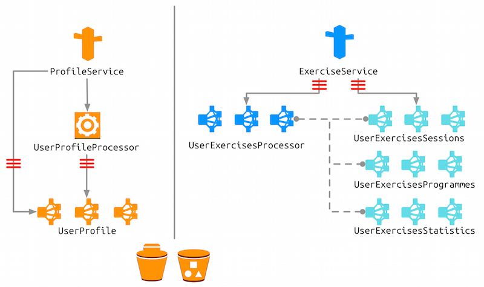

# Muvr

[muvr](http://www.muvr.io/) is a demonstration of an application that uses _wearable devices_ (Pebble)—in combination with a mobile app—to submit physical (i.e. accelerometer, compass) and biological (i.e. heart rate) information to a CQRS/ES cluster to be analysed.

## Components of the system
The system consists of several components that reside in their own repositories.

#### [muvr-ios](https://github.com/muvr/muvr-ios)
`muvr-ios` is a fitness app showcasing the possibilities of mobile analytics. The app collects data from sensors (e.g. a pebble watch) and uses the information to classify your movements to keep track of your workout.

This part of the project is mostly written using Swift 2. Some classes use Objective-C / Objective-C++ for easier interfacing with external libraries.

#### [muvr-pebble](https://github.com/muvr/muvr-pebble)
`muvr-pebble` is a small pebble watch fitness tracking application. It captures movement data, displays classification results and keeps track of your exercise plan.  

This part of the project is written in plain old C.

#### [muvr-server](https://github.com/muvr/muvr-server)
`muvr-server` is a CQRS/ES cluster implementation for handling large incoming data streams from mobile devices. t is event-driven: throughout the application, it uses message-passing to provide loose-coupling and asynchrony between components. It is elastic: the users and their exercises—the domain—is sharded across the cluster. It is resilient: its components can recover at the appropriate level, be it single actor, trees of actors or entire JVMs. It also uses event sourcing to ensure that even catastrophic failures and the inevitable bugs can be recovered from. It is responsive: it does not block, and it is capable of distributing the load across the cluster.

This part of the project is written using `scala` and its build tool `sbt`.

#### [muvr-analytics](https://github.com/muvr/muvr-analytics)
`muvr-analytics` contains analytics pipelines external to the main application, including
* pipelines to suggest future exercise sessions
* pipelines to classify users to groups by attribute similarity
* pipelines to improve classification and other models
* pipelines to train models to recognize repetitions of exercises

Here is an example of what the captured data looks like:

And here is a birdseye view of a whole exercise session:

This part of the project can be viewed as a data science playground. The models used in the application are trained using spark jobs written in either scala or python. Tasks that require more explorational analysis can be done using R.

## Talks
- ["Cassandra as event sourced journal for big data analytics", Anirvan @ Scala Days Amsterdam 2015](http://www.eigengo.com/scaladays-ams-2015/)
- ["Exercise Analysis", Jan @ Scala Days Amsterdam 2015](http://www.eigengo.com/scaladays-ams-2015/)
- ["Implementing Exercise Wearables Analysis with Spark and Akka", Jan @ Philly ETE 2015](http://chariotsolutions.com/presentation/philly-ete-2015-jan-machacek-implementing-exercise-wearables-analysis-spark-akka/)
- ["Exercise in machine learning", Jan @ Scala Days SF 2015](https://www.parleys.com/tutorial/exercise-machine-learning)
- ["Building distributed Akka systems", Jan @ Scala Exchange 2014](https://skillsmatter.com/skillscasts/5840-building-distributed-akka-systems)
